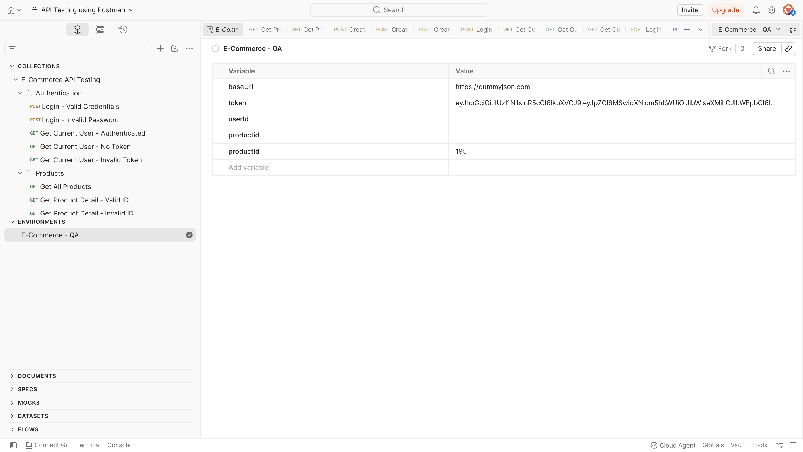
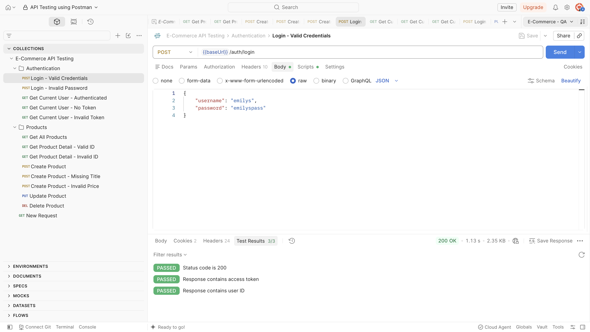
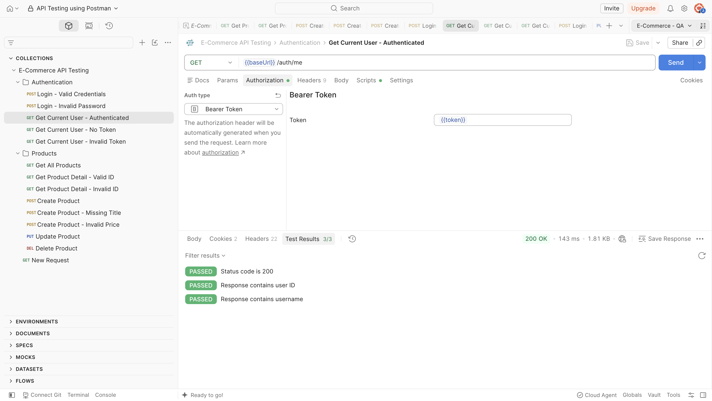
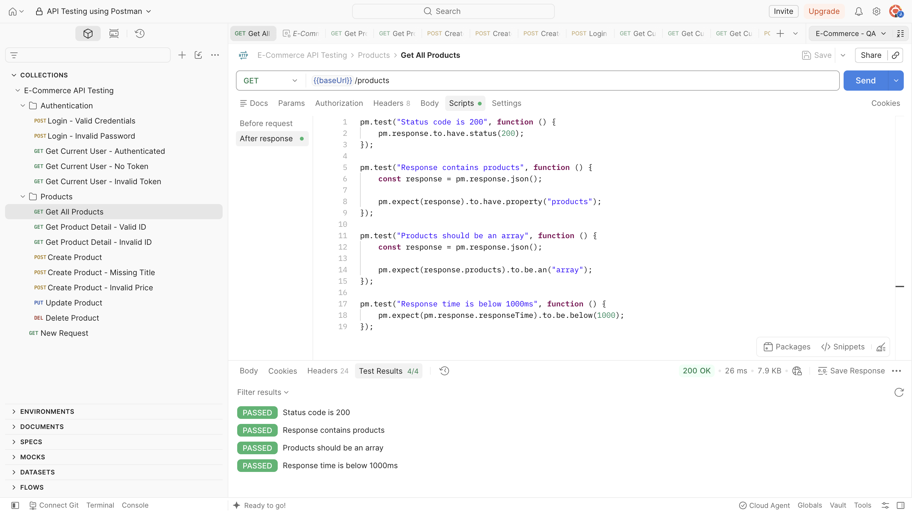
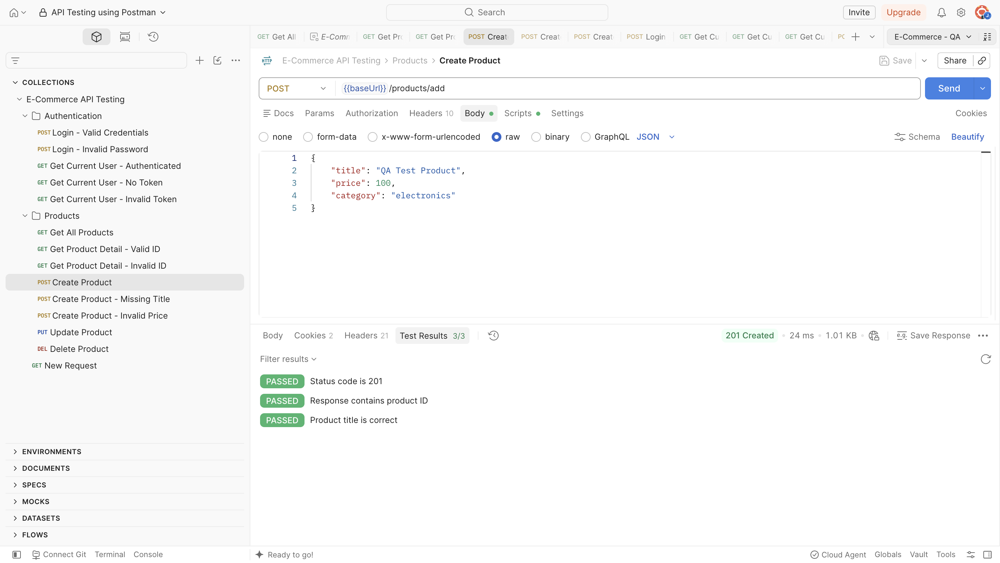
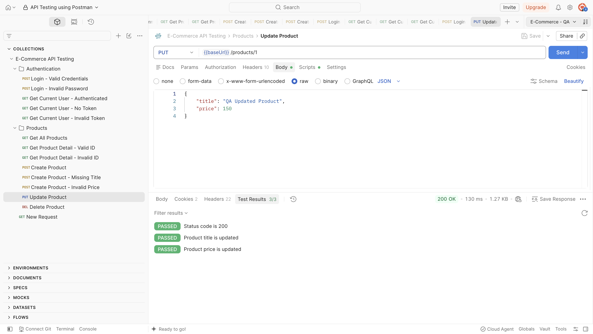
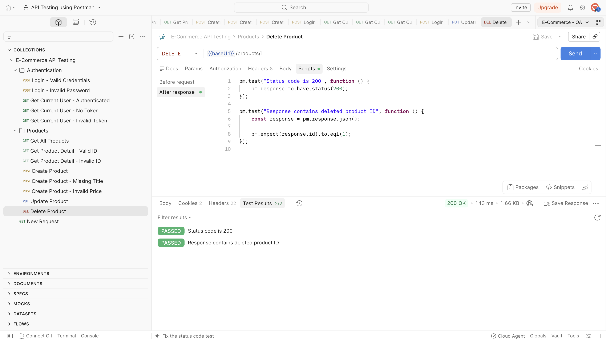

# API Testing Documentation

## 1. Project Overview

This project demonstrates basic API testing using Postman on the DummyJSON API.

The testing focuses on authentication and product management, including positive testing, negative testing, CRUD operations, response validation, environment variables, and automated assertions.


## 2. Testing Objectives

The objectives of this project are:

- Verify API responses using HTTP status codes.
- Validate response body and response properties.
- Test authentication using access tokens.
- Use environment variables for reusable API data.
- Perform CRUD operations on product endpoints.
- Create basic automated assertions using Postman scripts.
- Document test scenarios and observed API behavior.


## 3. Tools & Technologies

| Tool | Purpose |
|---|---|
| Postman | API request execution and automated testing |
| Visual Studio Code | Project documentation and Git management |
| GitHub | Portfolio and version control |
| Excel / Google Sheets | Test case documentation |


## 4. Test Environment

The Postman collection uses an environment variable for the API base URL:

| Variable | Purpose |
|---|---|
| `baseUrl` | Stores the API base URL |
| `token` | Stores the access token returned from login |
| `productId` | Stores the ID returned by the create-product request |

The access token is generated from the valid login request and stored automatically using a Postman test script.

### Environment Evidence




# 5. Authentication Testing

## 5.1 Login - Valid Credentials

### Objective

Verify that a user can log in using valid credentials.

**Method:** `POST`

**Endpoint:** `/auth/login`

### Test Data

```json
{
  "username": "emilys",
  "password": "emilyspass"
}
```

### Expected Result

- Response status is `200 OK`.
- Response contains an `accessToken`.
- Response contains a user `id`.

### Test Implementation

Postman assertions were added to validate the response status and required response properties.

The returned access token is also stored in the `token` environment variable for use in authenticated requests.

### Result

**PASS — 200 OK**

### Evidence




## 5.2 Login - Invalid Password

### Objective

Verify that login with an invalid password is rejected.

**Method:** `POST`

**Endpoint:** `/auth/login`

### Test Data

```json
{
  "username": "emilys",
  "password": "wrongpassword123"
}
```

### Expected Result

`400 Bad Request`

### Actual Result

`400 Bad Request`

### Result

**PASS**


## 5.3 Get Current User - Authenticated

### Objective

Verify that an authenticated user can access the current-user endpoint.

**Method:** `GET`

**Endpoint:** `/auth/me`

**Authorization:** Bearer Token

```text
Bearer {{token}}
```

### Expected Result

- Response status is `200 OK`.
- Response contains user `id`.
- Response contains `username`.

### Result

**PASS — 200 OK**

### Evidence




## 5.4 Get Current User - No Token

### Objective

Verify that the current-user endpoint rejects requests without an authentication token.

**Method:** `GET`

**Endpoint:** `/auth/me`

### Expected Result

`401 Unauthorized`

### Actual Result

`401 Unauthorized`

### Result

**PASS**


## 5.5 Get Current User - Invalid Token

### Objective

Verify that the current-user endpoint rejects an invalid authentication token.

**Method:** `GET`

**Endpoint:** `/auth/me`

### Test Data

```text
invalid-token-123
```

### Expected Result

`401 Unauthorized`

### Actual Result

`401 Unauthorized`

### Result

**PASS**


# 6. Product API Testing

## 6.1 Get All Products

### Objective

Verify that the API returns the available products.

**Method:** `GET`

**Endpoint:** `/products`

### Expected Result

- Response status is `200 OK`.
- Response contains a `products` property.
- `products` is returned as an array.
- Response time is below 1000 ms.

### Automated Assertions

The Postman test script validates:

```text
Status code = 200
products property exists
products is an array
response time < 1000 ms
```

### Result

**PASS — 200 OK**

### Evidence




## 6.2 Get Product Detail - Valid ID

### Objective

Verify that product details can be retrieved using a valid product ID.

**Method:** `GET`

**Endpoint:** `/products/1`

### Expected Result

- Response status is `200 OK`.
- Response contains a product `id`.
- Product ID is `1`.
- Product title is not empty.

### Result

**PASS — 200 OK**


## 6.3 Get Product Detail - Invalid ID

### Objective

Verify that the API returns an error when an unavailable product ID is requested.

**Method:** `GET`

**Endpoint:** `/products/999999`

### Expected Result

`404 Not Found`

### Actual Result

`404 Not Found`

### Result

**PASS**


# 7. CRUD Testing

## 7.1 Create Product

### Objective

Verify that a new product can be created using the product API.

**Method:** `POST`

**Endpoint:** `/products/add`

### Request Body

```json
{
  "title": "QA Test Product",
  "price": 100,
  "category": "electronics"
}
```

### Expected Result

- Response status is `201 Created`.
- Response contains a product `id`.
- Response contains the submitted product title.

### Automated Assertions

The response is validated using Postman assertions for:

- HTTP status code
- Product ID
- Product title

The returned product ID is also stored in the `productId` environment variable.

### Result

**PASS — 201 Created**

### Evidence




## 7.2 Create Product - Missing Title

### Objective

Verify API behavior when the product title is omitted.

**Method:** `POST`

**Endpoint:** `/products/add`

### Request Body

```json
{
  "price": 100,
  "category": "electronics"
}
```

### Expected Behavior

If `title` is a required field, the API should return a validation error.

### Actual Result

`201 Created`

### Finding

The API accepted the request even though the `title` field was omitted.

This behavior is documented as a finding rather than being classified as a confirmed application defect, because the testing environment is a simulated API and no separate product validation requirement was provided.


## 7.3 Create Product - Invalid Price

### Objective

Verify API behavior when the `price` field receives a non-numeric value.

**Method:** `POST`

**Endpoint:** `/products/add`

### Request Body

```json
{
  "title": "QA Test Product",
  "price": "ABC",
  "category": "electronics"
}
```

### Expected Behavior

If `price` is required to be numeric, the API should return a validation error.

### Actual Result

`201 Created`

### Finding

The API accepted a non-numeric value for the `price` field.

This behavior is documented as a finding rather than being classified as a confirmed application defect.


## 7.4 Update Product

### Objective

Verify that an existing product can be updated.

**Method:** `PUT`

**Endpoint:** `/products/1`

### Request Body

```json
{
  "title": "QA Updated Product",
  "price": 150
}
```

### Expected Result

- Response status is `200 OK`.
- Product title is returned as `QA Updated Product`.
- Product price is returned as `150`.

### Automated Assertions

Postman assertions validate the response status, updated title, and updated price.

### Result

**PASS — 200 OK**

### Evidence




## 7.5 Delete Product

### Objective

Verify that an existing product can be deleted.

**Method:** `DELETE`

**Endpoint:** `/products/1`

### Expected Result

- Response status is `200 OK`.
- Response contains the deleted product ID.

### Result

**PASS — 200 OK**

### Evidence




# 8. Automated Assertions

Postman automated tests were used to validate API responses.

Examples of validations implemented in the collection include:

```javascript
pm.test("Status code is 200", function () {
    pm.response.to.have.status(200);
});
```

Response properties were also validated using:

```javascript
const response = pm.response.json();

pm.expect(response).to.have.property("id");
```

For product data:

```javascript
pm.expect(response.title).to.eql("QA Updated Product");
pm.expect(response.price).to.eql(150);
```

These assertions allow API responses to be validated automatically instead of relying only on manual inspection.


# 9. Test Cases

A separate test case sheet was created to document the testing scenarios, expected results, actual results, and execution status.

The test cases cover:

- Authentication
- Product retrieval
- Product creation
- Product update
- Product deletion
- Negative scenarios
- Response validation

The detailed test case file is available in the `test-cases` directory.


# 10. Test Execution Summary

| Metric | Result |
|---|---:|
| Total Test Scenarios | 13 |
| Executed | 13 |
| Passed | 11 |
| Findings | 2 |
| Failed | 0 |

The two findings relate to the API accepting a missing product title and a non-numeric product price.


# 11. Key Findings

### Finding 01 — Missing Product Title

The create-product endpoint accepted a request without the `title` field and returned `201 Created`.

### Finding 02 — Invalid Price Type

The create-product endpoint accepted a string value for `price` and returned `201 Created`.

These findings demonstrate the use of negative testing to identify unexpected API behavior.


# 12. Conclusion

This project demonstrates a basic API testing workflow using Postman.

The testing covered:

- Authentication testing
- Bearer token authentication
- Environment variables
- Positive testing
- Negative testing
- CRUD API testing
- Response validation
- Automated Postman assertions
- Test case documentation

The project is intended as a QA portfolio project demonstrating fundamental API testing skills.
